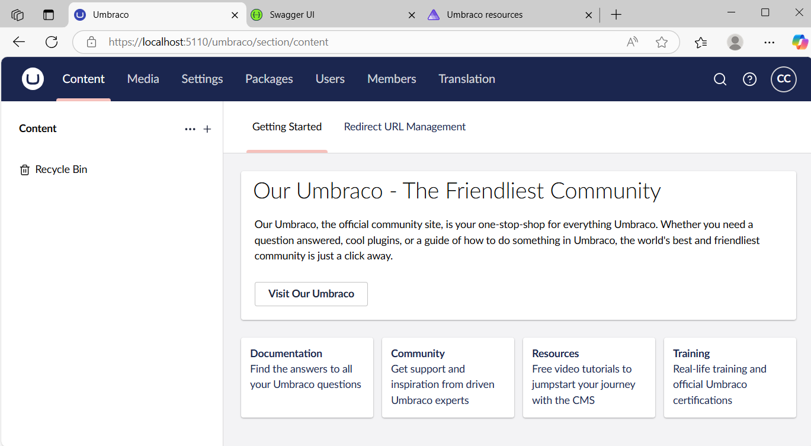
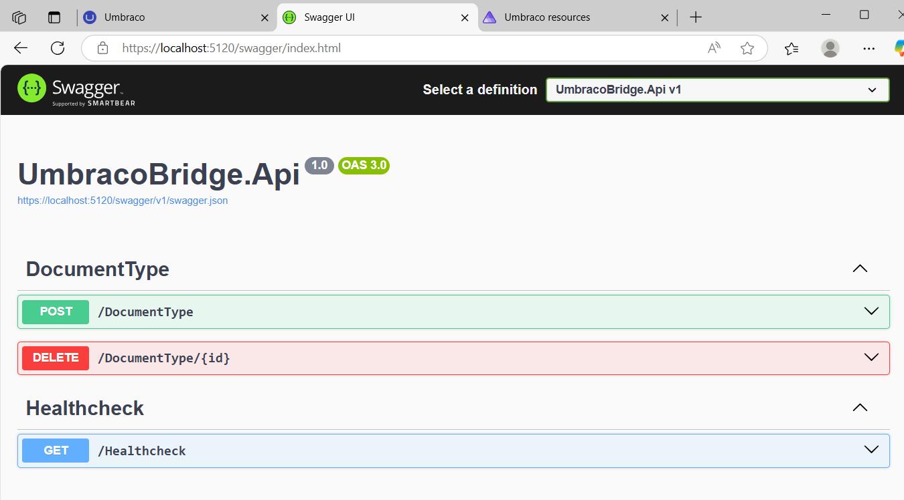
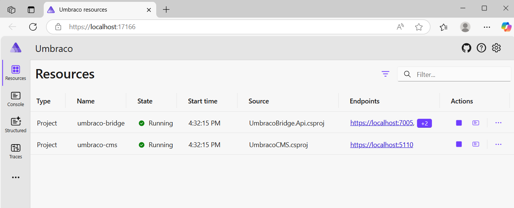
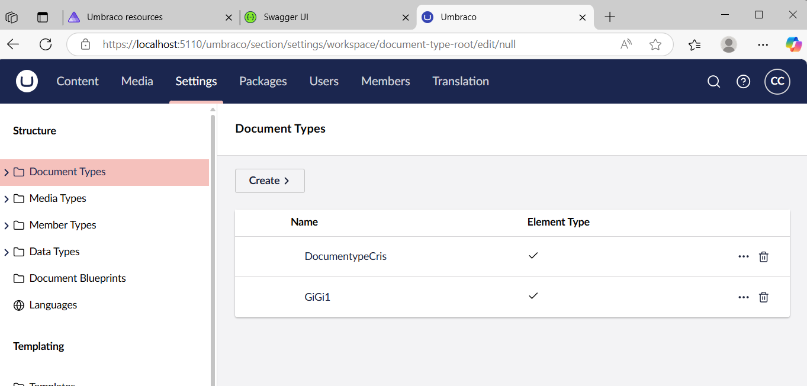
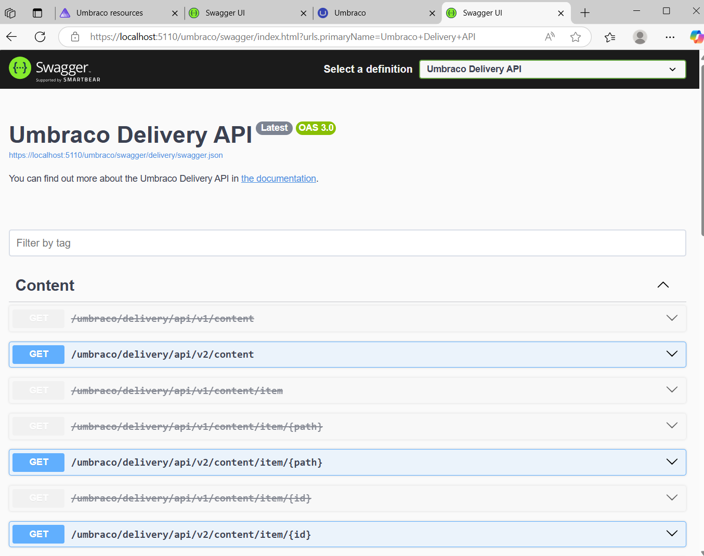
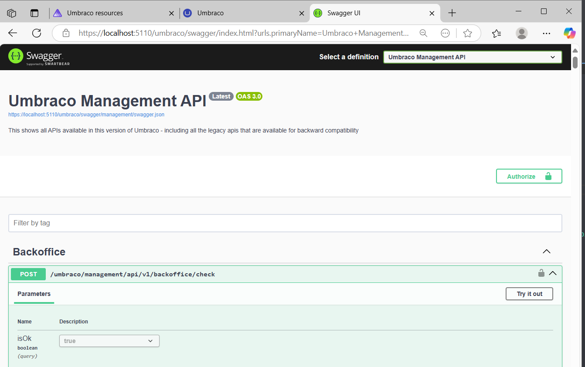

# 🧙‍♂️ MORGANA's Trial

Morgana needs your help to bring Round Table 2.0 to life by building a robust integration between a CMS and a Web API. This .NET 9 solution lays the foundation for a modern architecture with clean boundaries and solid communication via the Umbraco Management API.

**Content**
- [🧙‍♂️ MORGANA's Trial](#️-morganas-trial)
  - [📦 Overview of the Solution](#-overview-of-the-solution)
    - [1. **UmbracoCMS**](#1-umbracocms)
    - [2. **UmbracoBridge**](#2-umbracobridge)
    - [3. **UmbracoAppHost**](#3-umbracoapphost)
    - [📁 Project structure](#-project-structure)
  - [🚀 Steps to Set Up and Run the Solution Locally](#-steps-to-set-up-and-run-the-solution-locally)
    - [🛠 Prerequisites](#-prerequisites)
    - [⚙️ Running the Full System with Aspire](#️-running-the-full-system-with-aspire)
  - [📡 Web API Endpoints (via UmbracoBridge)](#-web-api-endpoints-via-umbracobridge)
    - [✅ GET /healthcheck](#-get-healthcheck)
    - [🧾 POST /document-type](#-post-document-type)
      - [🔒 Validation Rules](#-validation-rules)
    - [❌ DELETE /document-type/{id}](#-delete-document-typeid)
  - [✅ Instructions for Verifying the Setup](#-instructions-for-verifying-the-setup)
  - [🧪 Unit Testing](#-unit-testing)
    - [🔍 Overview of Covered Tests](#-overview-of-covered-tests)
    - [🔎 DocumentTypeRequestValidatorTests](#-documenttyperequestvalidatortests)
    - [🛴How run tests:](#how-run-tests)
  - [❗Side Quests](#side-quests)
    - [📦 Delivery API (UmbracoCMS)](#-delivery-api-umbracocms)
      - [✅ Configuration:](#-configuration)
    - [🔗 Aspire – UmbracoAppHost](#-aspire--umbracoapphost)
      - [🏗 How it was created](#-how-it-was-created)
      - [⚙️ Service Registration and Configuration](#️-service-registration-and-configuration)
      - [🖥 Aspire Dashboard](#-aspire-dashboard)
    - [🔧 Backoffice API](#-backoffice-api)
      - [✅ What Was Done](#-what-was-done)

## 📦 Overview of the Solution

This solution contains the following projects:

### 1. **UmbracoCMS**
A standalone CMS project powered by Umbraco 15. It provides the native endpoints from the Umbraco Management API.


### 2. **UmbracoBridge**
A clean, decoupled Web API (ASP.NET Core) that acts as a **bridge** to the CMS. It authenticates using client credentials and exposes simplified, custom endpoints for external consumers.


### 3. **UmbracoAppHost**
A .NET Aspire project that orchestrates and hosts both services locally for easy setup and discovery.



### 📁 Project structure
```cs
morgana-challenge/
├── Umbraco.sln
├── UmbracoAppHost
├── UmbracoCMS
├── UmbracoBridge/
│   ├── UmbracoBridge.Api/              --> Controllers & API configuration
│   ├── UmbracoBridge.Application/      --> Interfaces, DTOs, business logic
│   └── UmbracoBridge.Infrastructure/   --> HTTP client & integration external logical
│   └── UmbracoBridge.Tests/            --> unit tests
```
```cs
[UmbracoBridge API] --> [Management API on UmbracoCMS] via token
```

---

## 🚀 Steps to Set Up and Run the Solution Locally

### 🛠 Prerequisites

- [.NET 9 SDK](https://dotnet.microsoft.com/en-us/download/dotnet/9.0)
- [Visual Studio 2022+ ](https://visualstudio.microsoft.com/)

---

### ⚙️ Running the Full System with Aspire

```bash
git clone https://github.com/cristhyanGlobant/morgana-challenge.git

cd morgana-challenge
dotnet build

cd UmbracoAppHost
dotnet run
```

This will:
- Launch the Aspire dashboard at https://localhost:17166
- Start UmbracoCMS at https://localhost:5110/
- Start UmbracoBridge at https://localhost:5120/ 

--- 

## 📡 Web API Endpoints (via UmbracoBridge)
All endpoints are exposed via Swagger. Example base URL:
https://localhost:5120/swagger/index.html

### ✅ GET /healthcheck
Forwards the request to the Umbraco Management API’s health check endpoint.

Request:
```http
GET /healthcheck
```

Response body
```json
{
  "total": 6,
  "items": [
    {
      "name": "Configuration"
    },
    {
      "name": "Data Integrity"
    },
    {
      "name": "Live Environment"
    },
    {
      "name": "Permissions"
    },
    {
      "name": "Security"
    },
    {
      "name": "Services"
    }
  ]
}
```

### 🧾 POST /document-type
Creates a new document type in Umbraco.

Curl Request:
```bash
curl -X 'POST' \
  'https://localhost:7005/DocumentType' \
  -H 'accept: */*' \
  -H 'Content-Type: application/json' \
  -d '{
  "alias": "CrisDoc",
  "name": "DocumentypeCris",
  "description": "a document type for Cris",
  "icon": "icon-1234",
  "allowAsRoot": true,
  "variesByCulture": true,
  "variesBySegment": true,
  "isElement": true
}'
```

Response body:
```json
"d1d054be-1f42-4dda-832c-e2de8b70efcd"
```

#### 🔒 Validation Rules
The request body is validated:
- `alias`, `name`, and `description` **must not be empty**
- `icon` **must start with** `"icon-"`

If validation fails, the API returns 400 Bad Request.



---

### ❌ DELETE /document-type/{id}

Deletes a document type by ID.

Request:
```bash
curl -X 'DELETE' \
  'https://localhost:7005/DocumentType/d1d054be-1f42-4dda-832c-e2de8b70efcd' \
  -H 'accept: */*'
```

Response
- `204 No Content` on success
- `404 Not Found` if the document type doesn't exist

<br/>
<br/>


## ✅ Instructions for Verifying the Setup
1. Run the solution from AppHost:

    ```bash
    cd AppHost
    dotnet run
    ```

2. Visit Swagger UI:
    Open: `https://localhost:5120/swagger/index.html`

3. Test endpoints:
    - Use Postman or Swagger to call `GET /healthcheck`
    - Create a document with `POST /document-type`
    - Delete it using `DELETE /document-type/{id}`

4. Check the Aspire dashboard for service logs:
    - `https://localhost:17166/`


## 🧪 Unit Testing
Unit tests were added to ensure correctness, modularity, and maintainability of the UmbracoBridge application. Tests are written using xUnit and follow the Arrange-Act-Assert pattern.

### 🔍 Overview of Covered Tests
| Test Class                          | Purpose                                                                                                                         |
| ----------------------------------- | ------------------------------------------------------------------------------------------------------------------------------- |
| `DocumentTypeControllerTests`       | Validates the behavior of the `DocumentTypeController`, including POST and DELETE endpoints for Umbraco document types.         |
| `HealthcheckControllerTests`        | Validates the behavior of the `HealthcheckControllerTests` by simulating health check requests.                                         |
| `UmbracoServiceTests`               | Validates the integration logic encapsulated in the `UmbracoService`, including token acquisition and API calls to Umbraco CMS. |

### 🔎 DocumentTypeRequestValidatorTests

This test class verifies the correctness of the FluentValidation rules defined in DocumentTypeRequestValidator, which applies to the `DocumentTypeRequestDto` used in the POST document type flow.

Validation logic tested:
| Field         | Rule                                                               | Test Coverage                                                |
| ------------- | ------------------------------------------------------------------ | ------------------------------------------------------------ |
| `Name`        | Must not be empty                                                  | ✅ Has error when empty                                       |
| `Description` | Must not be empty                                                  | ✅ Has error when empty                                       |
| `Icon`        | Must not be empty and must start with `"icon-"`                    | ✅ Error when empty<br>✅ Error if not prefixed with `"icon-"` |
| All fields    | When all values are valid, no validation errors should be returned | ✅ Fully valid model passes                                   |


### 🛴How run tests:
```bash
cd UmbracoBridge/UmbracoBridge.Tests
dotnet test
```
Ensure these packages are installed:
- `xUnit`
- `Moq`
- `FluentValidation.TestHelper`
- `FluentAssertions`


---

## ❗Side Quests

These optional enhancements were implemented to expand the functionality and modernity of the solution:


### 📦 Delivery API (UmbracoCMS)
---
The **Delivery API** was enabled in the `UmbracoCMS` project to allow read-only access to content via REST.



#### ✅ Configuration:
- Activated via the call to `.AddDeliveryApi()` in `Program.cs`:

    ```csharp
    builder.CreateUmbracoBuilder()
        .AddBackOffice()
        .AddWebsite()
        .AddDeliveryApi() // ✅ Enables Delivery API
        .AddComposers()
        .Build();
    ```
- Also I  configure the API Key in `appsettings.json`:    
    ```json
    {
        "Umbraco": {
            "CMS": {
                "DeliveryApi": {
                    "Enabled": true,
                    "ApiKey": "my-secure-key"
                }
            }
        }
    }
    ```

### 🔗 Aspire – UmbracoAppHost
---
A third project named **AppHost** was created using [.NET Aspire](https://learn.microsoft.com/en-us/dotnet/aspire/overview), a new cloud-native development stack introduced in .NET 8+ for composing, configuring, and running distributed applications locally.


🎯 Purpose:
- Orchestrates the `UmbracoCMS` and `UmbracoBridge` services.
- Enables service discovery, environment variable injection, and health monitoring.
- Provides a visual dashboard for observing the entire application topology.

#### 🏗 How it was created

The Aspire AppHost project was generated using the official .NET Aspire project template. You can scaffold it using the following command:

```bash
dotnet new aspire-app --name UmbracoAppHost
```

📁 Project Structure
The structure looks like this:

```cs
/UmbracoAppHost
├── UmbracoAppHost.csproj
├── Program.cs
└── Service defaults and project references
```

#### ⚙️ Service Registration and Configuration
Both the `UmbracoCMS` and `UmbracoBridge` projects were registered within UmbracoAppHost and environment variables were injected as needed:

```csharp
var builder = DistributedApplication.CreateBuilder(args);

var umbracoCms = builder.AddProject("umbraco-cms", "../UmbracoCMS/UmbracoCMS.csproj")
    .WithEndpoint(name: "https-umbraco", port: 5110, scheme: "https")
    .WithEnvironment("Umbraco__DeliveryApi__Enabled", "true")
    .WithEnvironment("Umbraco__DeliveryApi__ApiKey", "my-secret-api-key");

var umbracoBridge = builder.AddProject("umbraco-bridge", "../UmbracoBridge/UmbracoBridge.Api/UmbracoBridge.Api.csproj")
    .WithEndpoint(name: "https-bridge", port: 5120, scheme: "https")
    .WithEnvironment("DeliveryApi__ApiKey", "my-secret-api-key")
    .WithReference(umbracoCms); // cross-reference to consume UmbracoCMS API

builder.Build().Run();
```
#### 🖥 Aspire Dashboard
Running the UmbracoAppHost project launches the Aspire Dashboard at: `https://localhost:17166`
From the dashboard, you can:
- Visualize all running services and dependencies
- View logs, metrics, and health probes
- Debug startup issues or misconfigurations

---

### 🔧 Backoffice API
Create a new API inside the UmbracoCMS project as part of the Umbraco Management API, with the following behavior:
- Endpoint: `POST /umbraco/management/api/v1/backoffice/check`
- Parameter: `bool isOk` (provided via query string)
- Behavior:
  - Returns `200 OK` with message `"Status is OK."` if `isOk` is `true`.
  - Returns `400 BadRequest` with message `"Status is not OK."` if `isOk` is `false`.
- Must be visible under the **Umbraco Management API** section in Swagger UI.

✔️ Swagger UI – Group “Backoffice”


#### ✅ What Was Done
- A new controller named `BackofficeController` was created in the `Umbraco.Cms.Management.Api.Controllers.Backoffice` namespace.

- The controller inherits from `ManagementApiControllerBase` to ensure proper integration with Umbraco’s Management API pipeline.

- The controller defines a single endpoint: `POST /umbraco/management/api/v1/backoffice/check`

- It accepts a bool isOk parameter from the query string and returns:
  - `200 OK` when `isOk` is `true`
  - `400 BadRequest` when `isOk` is `false`

- The controller is decorated with:
  - `[ApiExplorerSettings(GroupName = "Backoffice")]`
  to ensure the Swagger UI displays the endpoint under the **Backoffice** section (inside the "Umbraco Management API" definition).
  - `[ApiController]` and `[Route]` to configure endpoint routing properly.


---
✍️ Autor
* Jorge Cristhyan Contreras
* Github
